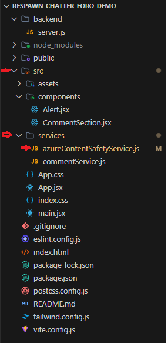

# Integración con APIs de Terceros - José Linares

## 1. Introducción

En el desarrollo de software moderno, la interacción entre aplicaciones se ha convertido en una práctica común y fundamental para crear soluciones eficientes y escalables.

Las APIs de terceros son aquellas que son proporcionadas por empresas externas, permitiendo que otros desarrolladores y organizaciones puedan integrar funcionalidades avanzadas en sus propias aplicaciones. Estas APIs abarcan una amplia gama de servicios, desde pagos en línea y almacenamiento en la nube, hasta la moderación de contenido y procesamiento de lenguaje natural. A través de la integración de APIs de terceros, los desarrolladores pueden acceder a soluciones especializadas sin tener que desarrollarlas desde cero, lo que acelera el ciclo de desarrollo y mejora la calidad de las aplicaciones.

En este informe, exploraremos los conceptos fundamentales detrás de las APIs de terceros, las ventajas y desafíos asociados con su integración, y proporcionaremos un análisis técnico sobre cómo implementar una API de moderación de contenido, enfocándonos en un entorno de desarrollo con Node.js.

## 2. Desarrollo Conceptual

Las APIs actuan como intermediarios que facilitan la comunicación entre diferentes sistemas, permitiendo que aplicaciones externas interactuen entre sí mediante el consumo de servicios o obteniendo datos de algún proveedor de API. Existen diferentes tipos de APIs para exponer o consumir, entre ellos tenemos los siguientes.

- **Tipos de APIs**:
  - *RESTful APIs*: Estas APIs, basadas en arquitectura REST, aprovechan los métodos HTTP (GET, POST, PUT, PATCH, DELETE) para interactuar con los datos. Generalmente devuelven los datos en JSON, pero también permite XML, HTML, texto plano y otros formatos.
  
  - *GraphQL APIs*: Brindan a los usuarios la capacidad de solicitar los datos de forma precisa. Se utiliza un lenguaje de consulta, permitiendo definir con exactitud qué datos se quieren obtener.
  
  - *SOAP APIs*: Se basan en el protocolo SOAP y utilizan XML para el intercambio de mensajes, ofrece un enfoque estructurado para la comunicación de sistemas.
  
## 3. Beneficios y Desafíos

- **Beneficios de la Integración**:
  - Reducción significativa del tiempo de desarrollo al aprovechar funcionalidades ya existentes.
  - Permite a los equipos de desarrollo centrarse en las características únicas de su aplicación.
  - Utilización de servicios probados y optimizados, lo que puede resultar en un mejor rendimiento y fiabilidad.
  - Capacidad de adaptar y escalar servicios según las necesidades cambiantes del negocio.
  - Ahorro en costos de desarrollo, mantenimiento y operación de servicios complejos.

- **Desafíos**:
  - Riesgo de interrupciones del servicio debido a problemas en los sistemas del proveedor de la API.
  - Necesidad de implementar estrategias de manejo de fallos y planes de contingencia.
  - Restricciones en el número de llamadas a la API, lo que puede limitar la funcionalidad o escalabilidad.
  - Riesgo de que cambios en la API del tercero afecten el funcionamiento de la aplicación.
  - Posible aumento en los tiempos de respuesta debido a la comunicación con servicios externos.

## 4. Servicios de APIs REST Populares para Integración

En el contexto de la integración de APIs de terceros, es esencial considerar algunas de las APIs más utilizadas que permiten añadir funcionalidades complejas a las aplicaciones de forma sencilla. A continuación, se describen varios servicios populares que se integran con RESTful APIs y sus aplicaciones específicas:

### 4.1 **Google Maps API**
Google Maps API es una de las APIs más conocidas en el ámbito de la geolocalización y mapas interactivos. Permite a los desarrolladores integrar mapas completamente personalizados en sus aplicaciones web o móviles. Ofrece capacidades como la visualización de mapas, el cálculo de rutas, autocompletado de direcciones, geocodificación, entre otras.

Google Maps es utilizado en aplicaciones de transporte, servicios de entrega, turismo y cualquier sistema que dependa de la ubicación del usuario. Su flexibilidad y capacidad de proporcionar datos en tiempo real lo convierten en una opción ideal para agregar funciones de geolocalización avanzadas.

**Características principales**:
- Mapas interactivos con capacidad de personalización, desde agregar marcadores hasta modificar estilos de mapas.
- Geocodificación y cálculo de rutas, permitiendo encontrar direcciones y trazar rutas entre puntos.
- Información en tiempo real sobre tráfico y tiempos estimados de llegada.

**Casos de uso**:
- Aplicaciones de transporte como Uber o Cabify.
- Servicios de entrega como Rappi, que requieren la localización en tiempo real de usuarios y repartidores.
- Apps de turismo que muestran puntos de interés cercanos o rutas turísticas.

### 4.2 **Stripe API**
Stripe API es una solución integral para gestionar pagos en línea, ampliamente utilizada en plataformas de comercio electrónico, servicios por suscripción y aplicaciones móviles. Es conocida por su facilidad de uso, documentación exhaustiva y soporte para una amplia variedad de métodos de pago a nivel global.

Stripe facilita la integración de pagos seguros sin que los desarrolladores tengan que preocuparse por manejar directamente información sensible de tarjetas de crédito. Además de pagos únicos, Stripe permite gestionar suscripciones, pagos recurrentes, reembolsos, y más, todo con el mismo conjunto de herramientas.

**Características principales**:
- Procesamiento de pagos con tarjetas de crédito, débito y otros métodos de pago (Google Pay, Apple Pay).
- Gestión de suscripciones, permitiendo pagos recurrentes de manera automática.
- Soporte para múltiples monedas, adaptando el procesamiento de pagos a nivel global.

**Casos de uso**:
- Plataformas de comercio electrónico que necesitan gestionar pagos de forma rápida y segura.
- Servicios de suscripción como plataformas de streaming o SaaS.
- Aplicaciones móviles que requieren integrar pagos de manera directa, como marketplaces.

### 4.3 **Twilio API**
Twilio ofrece una API potente para integrar servicios de comunicación, que incluyen envío de mensajes SMS, realización de llamadas telefónicas, y videollamadas. Es una API versátil utilizada en una amplia gama de aplicaciones, desde la verificación de identidad a través de SMS hasta la implementación de sistemas de soporte con llamadas automatizadas.

La API de Twilio es altamente escalable y puede ser utilizada para manejar tanto comunicaciones individuales como masivas. Su uso es común en aplicaciones que requieren notificaciones automáticas, verificación en dos pasos, o comunicación en tiempo real entre usuarios.

**Características principales**:
- Envío de SMS a nivel global para notificaciones, verificación de cuentas y alertas.
- Realización y gestión de llamadas telefónicas, tanto de voz como videollamadas.
- Escalabilidad para gestionar grandes volúmenes de mensajes o llamadas.

**Casos de uso**:
- Aplicaciones bancarias que utilizan SMS para verificación de identidad.
- Plataformas de soporte al cliente que automatizan llamadas y envían notificaciones a clientes.
- Apps de mensajería que integran videollamadas y llamadas de voz entre usuarios.

### 4.4 **Firebase API**
Firebase es una plataforma de desarrollo móvil y web que ofrece múltiples servicios backend listos para usar, como bases de datos en tiempo real, autenticación de usuarios, almacenamiento de archivos, y mucho más. Está diseñada para simplificar el desarrollo de aplicaciones proporcionando una infraestructura escalable y fácil de implementar.

Firebase es especialmente popular entre desarrolladores que desean construir aplicaciones móviles y web sin preocuparse por gestionar servidores o bases de datos manualmente. Su base de datos en tiempo real es uno de sus servicios más destacados, permitiendo sincronización automática de datos entre clientes en tiempo real.

**Características principales**:
- Base de datos en tiempo real que sincroniza datos entre clientes al instante.
- Autenticación de usuarios con soporte para múltiples métodos de autenticación, como Google, Facebook, y más.
- Almacenamiento de archivos y distribución de contenido multimedia.

**Casos de uso**:
- Aplicaciones de chat que requieren sincronización de mensajes en tiempo real.
- Juegos en línea que necesitan actualizar datos entre jugadores simultáneamente.
- Aplicaciones de redes sociales que almacenan y distribuyen contenido multimedia.

### 4.5 **SendGrid API**
SendGrid es una plataforma dedicada a la gestión de correos electrónicos, proporcionando una API que permite enviar y recibir correos a gran escala de manera eficiente. Es especialmente útil para notificaciones transaccionales, boletines y campañas de marketing por correo electrónico.

SendGrid facilita la personalización de correos electrónicos, el seguimiento de entregas, aperturas, y la gestión de listas de contactos. Es una herramienta imprescindible para cualquier aplicación que necesite enviar correos de manera segura y fiable a sus usuarios.

**Características principales**:
- Envío de correos electrónicos a gran escala con personalización avanzada.
- Gestión de campañas de marketing por correo con herramientas de análisis.
- Seguimiento de entregas, aperturas y clics en correos electrónicos.

**Casos de uso**:
- Plataformas de comercio electrónico que envían confirmaciones de pedido y notificaciones.
- Aplicaciones SaaS que envían actualizaciones a sus usuarios o notifican sobre nuevos servicios.
- Campañas de email marketing dirigidas a grandes audiencias.

### 4.6 **OpenWeatherMap API**
OpenWeatherMap proporciona acceso a datos meteorológicos en tiempo real y predicciones del clima. Esta API permite obtener información sobre el clima actual, predicciones a corto y largo plazo, y alertas meteorológicas. Es muy útil en aplicaciones que requieren mostrar o basar sus funciones en las condiciones meteorológicas, como apps de viaje, agricultura o deportes al aire libre.

**Características principales**:
- Información meteorológica en tiempo real para cualquier ubicación geográfica.
- Predicciones del clima a corto y largo plazo, basadas en datos meteorológicos precisos.
- Datos históricos de clima, permitiendo analizar tendencias pasadas.

**Casos de uso**:
- Aplicaciones de viajes que muestran la previsión meteorológica en destinos turísticos.
- Sistemas agrícolas que dependen de condiciones climáticas para optimizar cosechas.
- Apps deportivas que sugieren actividades basadas en el clima.

### Conclusión
La integración de estas APIs REST permite añadir funcionalidades avanzadas a las aplicaciones, evitando la necesidad de construir estas capacidades desde cero. Cada una de estas APIs ofrece soluciones especializadas que, cuando se integran correctamente, pueden optimizar la experiencia del usuario, reducir el tiempo de desarrollo y añadir características que, de otro modo, serían costosas y difíciles de implementar internamente.

## 5. API integrada a la demo

### **Azure AI Content Safety API**

Azure AI Content Safety es un servicio proporcionado por Microsoft que permite detectar y moderar contenido potencialmente dañino en plataformas digitales. Esta API utiliza modelos avanzados de inteligencia artificial para analizar tanto texto como imágenes, identificando amenazas como lenguaje ofensivo, discurso de odio, violencia y contenido sexual explícito. Su principal ventaja es la capacidad de moderar automáticamente grandes volúmenes de contenido en tiempo real, ayudando a mantener entornos seguros y libres de comportamientos inapropiados.

**Características principales**:
- Moderación de contenido en tiempo real para texto e imágenes.
- Capacidad para identificar lenguaje abusivo, intimidación, amenazas y contenido sexual explícito.
- Integración con plataformas de chat, redes sociales, foros de discusión y sistemas de comentarios.
- Ajuste de sensibilidad para personalizar el nivel de detección según las necesidades de la aplicación.
- Funcionalidad multilingüe para detectar contenido inapropiado en varios idiomas.
- Escudos de contenido sensible (Prompt Shields), Protege contra contenido riesgoso en entradas de usuario para modelos de lenguaje.
- Verifica si las respuestas de texto generadas por IA se basan en fuentes proporcionadas.

#### Límites de servicio
Para asegurar un rendimiento adecuado y evitar abusos, Azure AI Content Safety establece ciertos límites de entrada y velocidad en sus APIs. A continuación, se detallan los requisitos y restricciones:

- **Analizar API de texto**:
  - Longitud máxima: **10,000 caracteres**.
- **Analizar API de imágenes**:
  - Tamaño máximo de archivo: **4 MB**.
  - Dimensiones: entre **50x50** y **7200x7200** píxeles.
  - Formatos admitidos: **JPEG, PNG, GIF, BMP, TIFF, WEBP**.
- **Analizar API multimodal (texto e imagen)**:
  - Longitud máxima de texto: **1,000 caracteres**.
  - Tamaño máximo de imagen: **4 MB**.
  - Dimensiones: entre **50x50** y **7200x7200** píxeles.
  - Formatos admitidos: **JPEG, PNG, GIF, BMP, TIFF, WEBP**.
- **API de Prompt Shields**:
  - Longitud máxima del mensaje: **10,000 caracteres**.
  - Máximo de cinco documentos por consulta, con un total de hasta **10,000 caracteres**.
- **API de detección de conexión a tierra (Groundedness) (vista previa)**:
  - Longitud máxima para fuentes: **55,000 caracteres**.
  - Longitud máxima del texto de consulta: **7,500 caracteres**.
- **API de detección de material protegido**:
  - Longitud máxima: **1,000 caracteres**.
  - Longitud mínima: **110 caracteres** (aplicable a textos generados por LLMs).
- **API de categorías personalizadas (estándar)**:
  - Longitud máxima de entrada de inferencia: **1,000 caracteres**.

#### Tarifas de consulta
Azure AI Content Safety también aplica límites de velocidad para las consultas, medidos en solicitudes por segundo (RPS) o por cada 10 segundos (RP10S). Estos son los valores para cada API:

| Nivel de Precios | API de Moderación (Texto e Imagen) | Prompt Shields | Detección de Material Protegido | Groundedness | Categorías Personalizadas (rápidas) | Categorías Personalizadas (estándar) |
|------------------|-----------------------------------|----------------|-------------------------------|-------------|-------------------------------------|--------------------------------------|
| **F0**           | 5 RPS                             | 5 RPS          | 5 RPS                         | 10 RP10S    | 5 RPS                               | 10 RP10S                             |
| **S1**           | 1,000 RP10S                       | 1,000 RP10S    | 1,000 RP10S                   | 50 RP10S    | 1,000 RP10S                         | 5 RPS                                |

Para casos donde se necesiten tasas de consulta más rápidas, los clientes pueden **contactar con Azure** para solicitar tarifas personalizadas.


#### Casos de uso para texto:

 - **Foros de discusión**: Implementación de moderación automática en comentarios y respuestas para evitar discursos de odio, insultos o lenguaje inapropiado, asegurando un ambiente constructivo y respetuoso en las discusiones sobre videojuegos.
 - **Aplicaciones de soporte al cliente**: Supervisión de las interacciones entre usuarios y representantes de soporte técnico dentro del foro, garantizando que se mantenga un tono profesional y respetuoso en todas las conversaciones.
 - **Moderación de publicaciones y comentarios**: Permitir la identificación y bloqueo de contenido que infrinja las políticas de la comunidad de Respawn Chatter.

#### Casos de uso para imágenes:

 - **Moderación de imágenes subidas por usuarios**: Detección automática de imágenes explícitas o violentas en el foro, asegurando que el contenido visual compartido por los usuarios cumpla con las normativas de seguridad y respeto.
 - **Filtrado de avatares o imágenes de perfil**: Implementación de un sistema de filtrado para detectar avatares o imágenes de perfil que puedan contener contenido ofensivo o inapropiado, garantizando que la comunidad de Respawn Chatter se mantenga amigable y respetuosa.

#### Content Safety Studio
Azure ofrece el **Content Safety Studio**, una plataforma interactiva para gestionar contenido potencialmente ofensivo. Los usuarios pueden probar código de muestra y evaluar las capacidades de moderación del servicio. El estudio permite a los desarrolladores crear sistemas personalizados de moderación de contenido para ajustarse a las necesidades específicas de sus aplicaciones, ya sea mediante listas de bloqueo, niveles de sensibilidad o flujos de trabajo de moderación continua.

**Seguridad y Cifrado**:
Azure AI Content Safety cuenta con cifrado de datos en reposo, y los clientes pueden utilizar **Microsoft Entra ID** para gestionar el acceso a sus recursos, garantizando un entorno seguro para la moderación de contenido.

**Planes de precios**:
Azure AI Content Safety ofrece distintos niveles de servicio con precios basados en el volumen de registros procesados. Los planes incluyen:

- **Plan Gratuito**:
  - **Texto**: 5,000 registros de texto por mes.
  - **Imágenes**: 5,000 imágenes por mes.
  - **Características**:
    - Detección de materiales protegidos.
    - Escudos de seguridad (Prompt Shields).
    - Detección de la fiabilidad de contenido (Groundedness detection).

- **Plan Estándar**:
  - **Texto**: $0.38 por cada 1,000 registros de texto.
  - **Imágenes**: $0.75 por cada 1,000 imágenes.
  - **Características**: Incluye las mismas funcionalidades que el plan gratuito (Prompt Shields, detección de materiales protegidos y detección de fiabilidad).

> Un registro de texto en el nivel estándar contiene hasta 1,000 caracteres, medidos en puntos de código Unicode. Si un texto enviado a la API supera los 1,000 caracteres, cuenta como un registro adicional por cada unidad de 1,000 caracteres. Por ejemplo, un texto con 7,500 caracteres cuenta como 8 registros de texto, mientras que uno con 500 caracteres cuenta como 1 registro.

**Beneficios clave**:
- **Escalabilidad**: Azure AI Content Safety puede manejar grandes volúmenes de contenido de manera eficiente, haciendo que sea ideal para plataformas con millones de usuarios activos.
- **Automatización**: La API permite automatizar el proceso de moderación, reduciendo la necesidad de intervención manual y acelerando la detección de contenido inapropiado.
- **Cumplimiento normativo**: Ayuda a las empresas a cumplir con regulaciones de contenido y privacidad, asegurando que las plataformas no infrinjan normativas locales o internacionales.
- **Compatibilidad y Flexibilidad**: La API se puede integrar con diversas aplicaciones y sistemas, como servicios web, aplicaciones móviles y sistemas backend, ofreciendo flexibilidad en su implementación.

**Ejemplo de Implementación**:
En el contexto de esta demo, la Azure AI Content Safety API se utiliza para analizar los hilos y comentarios del foro en una plataforma de recomendación de videojuegos. Esto permite filtrar automáticamente cualquier mensaje que contenga lenguaje ofensivo o contenido que pueda violar las políticas de la comunidad, mejorando la experiencia del usuario y manteniendo un entorno respetuoso para todos.

## 6. Conclusión

La integración de APIs de terceros se ha convertido en una práctica esencial en el desarrollo de software moderno, permitiendo a las aplicaciones incorporar funcionalidades avanzadas sin tener que desarrollarlas desde cero. Servicios como **Google Maps**, **Stripe**, **Twilio**, **Firebase**, **SendGrid**, **OpenWeatherMap** y **Azure AI Content Safety** destacan por proporcionar soluciones especializadas que pueden mejorar significativamente la experiencia del usuario, acelerar el ciclo de desarrollo y garantizar la escalabilidad y fiabilidad de las aplicaciones.

Los beneficios de integrar estas APIs incluyen la reducción de tiempos de desarrollo, el acceso a servicios probados y optimizados, y la capacidad de escalar rápidamente según las necesidades del negocio. Sin embargo, también es necesario tener en cuenta los desafíos, como la dependencia de servicios externos, los posibles límites en el uso de las APIs, y la necesidad de implementar estrategias de manejo de errores y planes de contingencia.

En particular, Azure AI Content Safety API se destaca como una herramienta importante para la moderación de contenido en plataformas que manejan grandes volúmenes de interacciones de texto e imágenes. Al utilizar esta API en la demo, se demuestra cómo las empresas pueden garantizar entornos seguros y adecuados para sus usuarios, automatizando la detección de contenido inapropiado y reduciendo el riesgo de violaciones a las normativas de la comunidad.

## 7. Consideraciones Técnicas

### 7.1 Instalación y configuración del proyecto frontend

Para iniciar el desarrollo del módulo de foro, hemos elegido utilizar React como tecnología principal para el frontend, debido a su capacidad para construir interfaces de usuario dinámicas y reactivas. La instalación y configuración del proyecto se realizó siguiendo los siguientes pasos:

#### 7.1.1 **Crear un nuevo proyecto con Vite**:

  Nos ubicamos en la carpeta donde tenemos el frontend, usaremos vite para el demo :
  
  ```bash
  npm create vite@latest . 
  ```
  Seleccionamos la opción de react y javascript. Posteriormente, instalamos las dependecias front del proyecto

  ```bash
  npm install 
  ```

  Nos ubicamos en `vite.config.js` y cambiamos el puerto default del proyecto por uno personalizado agregando esto debajo de `plugins`

  ```js
  server: {
    port: 3000
  }
  ```

#### 7.1.2 **Instalamos tailwind y daisy UI**: 

  Usaremos los siguiente: 

  ```bash
  npm install -D tailwindcss postcss autoprefixer
  npx tailwindcss init -p
  ```

    Reemplazamos el contenido de `tailwind.config.js` por lo siguiente: 
  ```js
  /** @type {import('tailwindcss').Config} */
  export default {
    content: [
      "./index.html",
      "./src/**/*.{js,ts,jsx,tsx}",
    ],
    theme: {
      extend: {},
    },
    plugins: [],
  }
  ```

  actualizamos el index.css ubicado en .src/ con este contenido: 
  
  ```js
  @tailwind base;
  @tailwind components;
  @tailwind utilities;
  ```

  Instalamos daysi UI para usar sus componentes

  ```bash
  npm i -D daisyui@latest
  ```

  Agregamos daisyUI a la configuración en `tailwind.config.js`, importando daisyUI y lo agregamos en `plugins`: 

  ```js
  import daisyui from 'daisyui'

  export default {
  content: [
    "./index.html",
    "./src/**/*.{js,ts,jsx,tsx}",
  ],
  theme: {
    extend: {},
  },
  plugins: [daisyui],
  }
  ```

### 7.2 Configuración para probar el demo localmente

#### 7.2.1 **Clonación del proyecto**

 Para ejecutar el demo en local, primero clonamos el repositorio del proyecto con el siguiente comando: 

 ```bash
 git clone https://github.com/Joselinares17/respawn-chatter-foro-demo.git
 ```

 Después de clonar el proyecto, accedemos al directorio del mismo:

 ```bash
 cd respawn-chatter-foro-demo
 ```

 #### 7.2.2 **Instalación de dependencias**

 Una vez dentro del proyecto, instalamos todas las dependencias necesarios ejecutando: 

 ```bash
 npm install
 ```

 las dependencias que se instalan y demás configuraciones se puede encontrar en `package.json`: 

 ```json
 {
  "name": "respawn-chatter-foro-demo",
  "private": true,
  "version": "0.0.0",
  "type": "module",
  "scripts": {
    "dev": "vite",
    "server": "node backend/server.js",
    "build": "vite build",
    "lint": "eslint .",
    "preview": "vite preview"
  },
  "dependencies": {
    "@azure-rest/ai-content-safety": "^1.0.0",
    "axios": "^1.7.7",
    "cors": "^2.8.5",
    "dotenv": "^16.4.5",
    "express": "^4.21.1",
    "react": "^18.3.1",
    "react-dom": "^18.3.1",
    "react-icons": "^5.3.0",
    "react-router-dom": "^6.26.2"
  },
  "devDependencies": {
    "@eslint/js": "^9.11.1",
    "@types/react": "^18.3.10",
    "@types/react-dom": "^18.3.0",
    "@vitejs/plugin-react": "^4.3.2",
    "autoprefixer": "^10.4.20",
    "concurrently": "^9.0.1",
    "daisyui": "^4.12.12",
    "eslint": "^9.11.1",
    "eslint-plugin-react": "^7.37.0",
    "eslint-plugin-react-hooks": "^5.1.0-rc.0",
    "eslint-plugin-react-refresh": "^0.4.12",
    "globals": "^15.9.0",
    "nodemon": "^3.1.7",
    "postcss": "^8.4.47",
    "tailwindcss": "^3.4.13",
    "vite": "^5.4.8"
  }
}
 ```

#### 7.2.3 **Comandos para iniciar el frontend**

  El comando para ejecutar el frontend es: 

  ```bash
  npm run dev
  ```

  Para la demo no se tiene un backend en sí, porque se maneja en servicios directamente desde el frontend

#### 7.2.4 **Creación del recurso de Azure y configuración en local**
  Una vez iniciado sesión en Azure nos dirigimos `create a resource`, en el buscador ponemos "AI", te redirigirá a un menú y seleccionas la opción "Azure service only" te saldrá la siguiente página:

  

  Una vez hayas seleccionado la opción de `Create`, completamos los datos que nos indican y le damos a `Review + create`: 

  

  Creamos el recurso dandole a `Create`

  

  Esperamos a que el recurso termine de desplegar para despues seleccionar `Go to resource`:

  

  Te diriges al menu en `Resource Management` -> `Keys and Endpoint`, podrás visualizar las llaves y el endpoint para las solicitudes REST. Para el demo solo necesitas una llave y el endpoint. 

  

  En el caso de la demo, esos datos se hardcodean en `azureContentSafetyService.js`, se encuentra en: 

  

  Y las constantes asignadas en ese archivo son: `API_KEY` y `ENDPOINT`. Como se muestra a continuación:

  ```js
  const API_KEY = <REEMPLAZAR_KEY>;
  const ENDPOINT = <REEMPLAZAR_ENDPOINT>;
  ```

  Finalmente, al final del archivo deber asignarle esas constantes en los parámetros a la instancia que se está exportando de la clase `azureContentSafetyService`, de la siguiente manera: 

  ```js
  export default new AzureContentSafetyService(ENDPOINT, API_KEY);
  ```

  Con esto es suficiente para probar el demo localmente con tu propio recurso de Azure.

### 7.3 Anexos

  Enlace del vídeo: https://youtu.be/RrGcAlmjIx0

## 8. Referencias

  - Admin. (2019, 24 febrero). Consumir una API utilizando JavaScript | Manticore Labs ec -  Desarrollo Web y Móvil en el Ecuador. https://manticore-labs.com/2019/02/24/consumir-una-api-utilizando-javascript/
  - De Souza, I. (2021, 12 febrero). API rest: conoce la importancia de ese recurso para el desempeño de una página web. Rock Content - ES. https://rockcontent.com/es/blog/api-rest/
  - Fuster, G. (2022, 18 abril). Tutorial de Fetch API en JavaScript con ejemplos de JS Fetch, Post y Header. freeCodeCamp.org. https://www.freecodecamp.org/espanol/news/tutorial-de-fetch-api-en-javascript-con-ejemplos-de-js-fetch-post-y-header/
  - PatrickFarley. (2024, 3 septiembre). Inicio rápido: análisis del contenido del texto - Azure AI services. Microsoft Learn. https://learn.microsoft.com/es-es/azure/ai-services/content-safety/quickstart-text?tabs=visual-studio%2Cwindows&pivots=programming-language-rest
  - Skyone. (2024, 9 octubre). Tipos de API: Entenda as Diferenças e Aplicações. Skyone. https://skyone.solutions/es/blog/tipos-de-api/
  - Third-party APIs - Learn web development | MDN. (2024, 23 septiembre). MDN Web Docs. https://developer.mozilla.org/en-US/docs/Learn/JavaScript/Client-side_web_APIs/Third_party_APIs
  - PatrickFarley. (2024, 4 septiembre). What is Azure AI Content Safety? - Azure AI services. Microsoft Learn. https://learn.microsoft.com/en-us/azure/ai-services/content-safety/overview