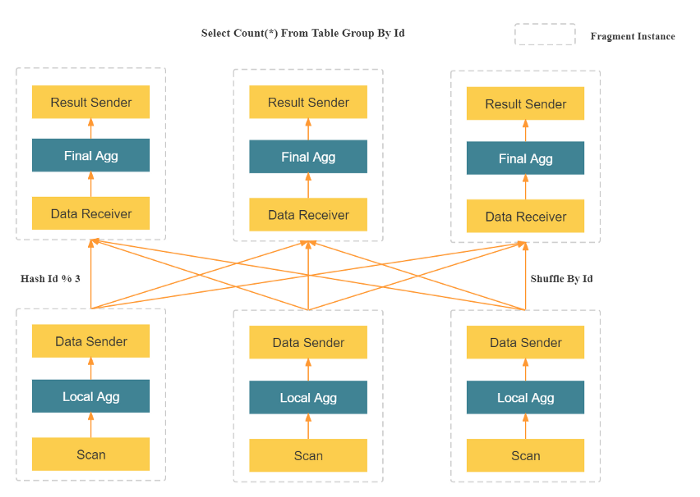

# Informe sobre Análisis de Datos en Tiempo Real

## Introducción

El análisis de datos en tiempo real se refiere al proceso de capturar, procesar y analizar datos a medida que son generados o recibidos. Este enfoque permite a las organizaciones tomar decisiones rápidas, reaccionar ante eventos inmediatos y obtener información valiosa instantáneamente, lo cual es esencial en sectores como el financiero, el comercio electrónico, la salud, las redes sociales y más.

## ¿En qué consiste el Análisis de Datos en Tiempo Real?

El análisis de datos en tiempo real implica el uso de herramientas y tecnologías que permiten procesar datos de forma continua y sin demoras. Este tipo de análisis es fundamental para detectar patrones, tendencias y anomalías que ocurren en el momento. La habilidad para analizar datos en tiempo real es crucial para las decisiones automatizadas, la detección de fraudes, el monitoreo de sistemas críticos y la optimización de operaciones.

## Opciones de Aplicaciones o Servicios de Análisis de Datos en Tiempo Real

Existen diversas aplicaciones y servicios para realizar análisis de datos en tiempo real. A continuación se detallan algunas de las opciones más utilizadas:

### 1. Apache Kafka
- **Descripción**: Kafka es una plataforma distribuida de transmisión de datos diseñada para manejar flujos de datos en tiempo real. Permite publicar, suscribirse y almacenar flujos de datos.
- **Características**:
  - Escalable y tolerante a fallos.
  - Funciona bien en entornos con grandes volúmenes de datos.
  - Ideal para integrar con otros sistemas de procesamiento en tiempo real.
- **Funcionalidades**:
  - Transmisión en tiempo real de grandes volúmenes de datos.
  - Procesamiento de datos en tiempo real utilizando Kafka Streams.
  - Integración con bases de datos y sistemas de análisis como Apache Flink.

  **Referencia**: [Apache Kafka - Official](https://kafka.apache.org/)

### 2. Apache Flink
- **Descripción**: Flink es una plataforma de procesamiento de flujos y lotes en tiempo real, ideal para análisis en tiempo real sobre datos complejos.
- **Características**:
  - Procesamiento de flujos y lotes.
  - Tolerancia a fallos y gestión de estados.
  - Alta eficiencia en procesamiento en paralelo.
- **Funcionalidades**:
  - Procesamiento de eventos en tiempo real y análisis de datos.
  - Soporte para consultas SQL en tiempo real.
  - Integración con sistemas de almacenamiento como Hadoop y Kafka.

  **Referencia**: [Apache Flink - Official](https://flink.apache.org/)

### 3. Google Cloud Dataflow
- **Descripción**: Es un servicio gestionado en la nube para procesamiento de datos en tiempo real que soporta tanto flujos como procesamiento por lotes.
- **Características**:
  - Administrado, por lo que no requiere infraestructura.
  - Escalable según la demanda.
  - Compatible con Apache Beam para desarrollo de pipelines de datos.
- **Funcionalidades**:
  - Integración nativa con Google Cloud Storage, BigQuery y otros servicios de Google.
  - Procesamiento de grandes volúmenes de datos de manera eficiente y escalable.

  **Referencia**: [Google Cloud Dataflow](https://cloud.google.com/dataflow)

### 4. Amazon Kinesis
- **Descripción**: Kinesis es un conjunto de servicios gestionados por AWS para el análisis de flujos de datos en tiempo real.
- **Características**:
  - Alta disponibilidad y escalabilidad.
  - Facilita la captura, el procesamiento y el análisis de datos en tiempo real.
- **Funcionalidades**:
  - Kinesis Streams para la transmisión de datos.
  - Kinesis Analytics para realizar análisis en tiempo real con SQL.
  - Kinesis Firehose para la carga de datos hacia otros servicios como Amazon S3 y Redshift.

  **Referencia**: [Amazon Kinesis - Official](https://aws.amazon.com/kinesis/)

### 5. StarRocks
- **Descripción**: StarRocks es una base de datos analítica optimizada para análisis en tiempo real, diseñada para procesar grandes volúmenes de datos con alta velocidad.
- **Características**:
  - Altamente eficiente en la ejecución de consultas analíticas de baja latencia.
  - Arquitectura distribuida para manejar petabytes de datos.
  - Capacidad de realizar análisis en tiempo real con soporte para datos en streaming.
- **Funcionalidades**:
  - **Integración en tiempo real**: StarRocks permite la ingesta de datos en tiempo real y la ejecución de consultas SQL de baja latencia.
  - **Compatibilidad con múltiples fuentes de datos**: Puede integrarse con Kafka, HDFS, y otros sistemas de almacenamiento.
  - **Procesamiento de consultas de baja latencia**: Utiliza un motor de consultas de alta velocidad para garantizar una respuesta rápida.
  - **Escalabilidad**: Su arquitectura distribuida le permite escalar según la carga de trabajo.

  **Referencia**: [StarRocks - Official](https://www.starrocks.io/)

## Cómo se trabaja con StarRocks

StarRocks se utiliza principalmente para realizar análisis de grandes volúmenes de datos en tiempo real con un enfoque en consultas rápidas y eficientes. Aquí se describe cómo trabajar con StarRocks:

1. **Ingesta de Datos en Tiempo Real**:
   - StarRocks puede integrar datos en tiempo real desde fuentes como Apache Kafka o sistemas de almacenamiento en la nube.
   - La ingesta de datos se realiza mediante mecanismos como **Stream Load** o **Batch Load**, dependiendo de la fuente de datos y los requerimientos de latencia.

2. **Consultas SQL en Tiempo Real**:
   - StarRocks soporta consultas SQL, lo que permite a los usuarios realizar análisis complejos en tiempo real utilizando una sintaxis estándar de SQL.
   - Estas consultas pueden ser utilizadas para realizar operaciones como agregaciones, filtros y uniones en datos de alto volumen y alta velocidad.

3. **Optimización de Consultas**:
   - StarRocks optimiza las consultas mediante el uso de técnicas como indexación de columnas y particionamiento de datos. Esto garantiza que las consultas se ejecuten con una latencia mínima.

4. **Escalabilidad**:
   - La arquitectura distribuida de StarRocks le permite escalar horizontalmente añadiendo nodos al clúster, lo que asegura que el rendimiento no se vea afectado conforme aumentan los volúmenes de datos o el número de consultas simultáneas.

## ESQUEMA DE FUNCIONAMIENTO DE STARROCKS

# Explicación del Diagrama de Procesamiento de Consultas en StarRocks

Este diagrama describe cómo StarRocks maneja una operación de agregación distribuida (como `COUNT(*)` con un `GROUP BY`) en un entorno de base de datos distribuida. StarRocks utiliza un enfoque de procesamiento en paralelo masivo (MPP) para manejar consultas distribuidas, asegurando alta eficiencia incluso con grandes volúmenes de datos.

## Componentes Clave del Diagrama

1. **Fragmentos y Distribución de Datos**:
   - StarRocks distribuye el procesamiento de la consulta en **fragmentos** (o fragment instances) que se ejecutan en diferentes nodos dentro de su clúster. Cada fragmento maneja una parte de los datos y realiza el procesamiento de manera paralela.
   - Cada fragmento puede ser responsable de procesar una parte de los datos, dependiendo de la forma en que se particionen los datos en el clúster.

2. **Scan y Agregación Local**:
   - El paso de **Scan** representa la lectura de los datos desde la base de datos. Cada fragmento escanea su porción de la tabla o conjunto de datos.
   - Después de escanear los datos, cada fragmento realiza una **agregación local** (`Local Agg`), es decir, una agregación preliminar sobre los datos de su propia partición. Este paso reduce la cantidad de datos que deben ser enviados a otros fragmentos para realizar una agregación final.

3. **Redistribución de Datos (Shuffle By Id)**:
   - Una vez que cada fragmento realiza la agregación local, los resultados deben ser redistribuidos entre los fragmentos para asegurarse de que los datos que pertenecen al mismo grupo de agregación (basado en la columna `Id` en este caso) se procesen en el mismo fragmento.
   - El proceso de **Shuffle By Id** asegura que los datos se muevan entre fragmentos según la clave de agrupación (el `Id`), de modo que cada fragmento reciba solo los datos relevantes para el grupo de agregación que le corresponde.

4. **Agregación Final y Envío de Resultados**:
   - Después de la redistribución de los datos, cada fragmento realiza una **agregación final** (`Final Agg`) para obtener el resultado global de la operación. En este caso, la agregación final podría ser el `COUNT(*)` de todos los elementos en cada grupo.
   - Finalmente, los resultados de la agregación se envían a una **instancia de resultados** (`Result Sender`), que se encarga de devolver el resultado final al usuario o al sistema que realizó la consulta.

## Cómo se Maneja el Proceso en StarRocks

- **Arquitectura Distribuida**: StarRocks es un sistema de bases de datos analíticas distribuido, lo que significa que puede manejar grandes volúmenes de datos y ejecutar consultas de manera paralela en múltiples nodos. Esto le permite distribuir y procesar los datos de manera eficiente.
  
- **Optimización de Consultas**: StarRocks utiliza un motor de consultas altamente optimizado para ejecutar consultas de agregación complejas de manera rápida. La distribución de las consultas en fragmentos permite una alta paralelización, lo que mejora el rendimiento, incluso con grandes volúmenes de datos.

- **Baja Latencia**: Gracias a su arquitectura MPP (procesamiento paralelo masivo), StarRocks es capaz de ejecutar consultas de agregación y otros análisis en tiempo real con baja latencia.

- **Escalabilidad**: La arquitectura de StarRocks le permite escalar horizontalmente, añadiendo más nodos al clúster según sea necesario, lo que permite manejar más datos y consultas simultáneas sin afectar el rendimiento.

## Referencias

- [StarRocks - Official Site](https://www.starrocks.io/)
- [Arquitectura de StarRocks](https://docs.starrocks.io/docs/introduction/StarRocks_intro/)

## Conclusión

El análisis de datos en tiempo real es esencial para las organizaciones que necesitan tomar decisiones rápidas basadas en datos. Existen varias soluciones tecnológicas para realizar este tipo de análisis, desde plataformas open source como Kafka y Flink, hasta servicios gestionados en la nube como Google Cloud Dataflow y Amazon Kinesis. StarRocks, en particular, se destaca como una opción para realizar consultas analíticas de baja latencia sobre grandes volúmenes de datos en tiempo real, integrándose con diversas fuentes de datos y ofreciendo una arquitectura escalable y eficiente para soportar cargas de trabajo intensivas en datos.

# CONSIDERACIONES TÉCNICAS

Para el uso de StarRocks hay dos formas eventualmente más utilizadas:

## OPCIÓN 1: INSTALAR DE MANERA LOCAL

Antes de Instalar StarRocks se debe tener en cuenta, los siguientes requisitos:

- Sistema operativo: Linux (Ubuntu, CentOS, Debian, etc.)
- Dependencias:
- Docker (para instalación en contenedores).
- Java 8 o superior (si no utilizas Docker).
- curl, wget y otras herramientas comunes de red.

Se debe ingresar al siguiente enlace: https://www.starrocks.io/download/community

Y dentro se debe seleccionar para que sistema operativo hay que tomar en cuenta que StarRocks trabaja en entornos Linux y trabaja con un servidor SQL:

Luego se selecciona la versión:

Esto traerá un archivo .zip que deberás descomprimir y acceder en caso estés usando Windows al WLS o el Subsistema Linux para Windows
El archivo contiene esto:

Si no se cuenta con eel wsl, usa el siguiente comando en tu cmd o Powershell: wsl --install

Después de haber habilitado WSL, necesitas instalar una distribución de Linux. Para hacerlo:

1. Abre Microsoft Store en tu PC.
2. Busca la distribución de Linux que prefieras, como Ubuntu, Debian, Kali Linux, openSUSE, o cualquier otra disponible.
3. Haz clic en la distribución que desees instalar, luego haz clic en Instalar.
4. Una vez instalada, haz clic en Iniciar para configurar tu entorno de Linux. Esto incluirá la creación de un usuario y una contraseña para tu distribución de Linux.

Una vez instalado wsl, se puede proseguir

Existen dos carpetas una llamada **be** y la otra llamada **fe**, porque StarRocks necesita de dos servidores tanto de frontend como de backend, por lo mismo es un poco complicado de ejecutar de manera local.

Dentro de **be** se encuentra lo siguiente:

y dentro de **fe** lo siguiente:

Los archivos que se deben ejecutar son **start_be.sh** y **start_fe.sh** todo desde el wsl de Windows.

Una vez ejecutados se podrá abrir una página como la de la imagen en el puerto localhost:8030

Y el backend debería estar corriendo en el purto 9030.

## OPCIÓN 2 (RECOMENDADA): UTILIZAR DOCKER

Instala Docker si aún no lo tienes. Puedes hacerlo ejecutando el siguiente comando en una terminal de Ubuntu:

`sudo apt-get update`
`sudo apt-get install docker.io`

Descarga la imagen oficial de StarRocks desde Docker Hub:

Existen muchas imágenes de StarRocks en Docker, pero lo recomendable si va a ser algo simple es usar el all in one:

`docker pull starrocks/allin1-ubuntu:latest`

Crea y ejecuta un contenedor para StarRocks usando Docker:

`docker run -d --name starrocks-all-in-one -p 9030:9030 -p 8030:8030 starrocks/allin1-ubuntu:latest`

Este comando ejecutará el contenedor de StarRocks en segundo plano. La opción -p mapea los puertos 9030 y 8030

Ahora, puedes acceder al servidor de StarRocks utilizando el puerto 9030, por ejemplo, con el cliente de MySQL:

`mysql -h 127.0.0.1 -P 9030 -u root -p`

Una vez dentro del terminal se pueden utilizar comandos similares a SQL, ya que StarRocks cuenta con su propio cliente de MySQL

# DEMO

## CASO

Se tiene un caso de ejemplo, el cual es el siguiente, se tiene que crear una base de datos en StarRocks que permita realizar análisis en tiempo real, para lo cual se tendrá una tabla llamada sensor_data en la que se simulará la obtención de data de un sensor de humedad y temperatura, esto hará que se actualice la data constantemente en la BD creada en StarRocks, asimismo se utilizará GRAFANA para la visualización de datos mediante Dashboard.

Para esto dentro del contenedor de StarRocks se coloca lo siguiente:

`mysql -h 127.0.0.1 -P 9030 -u root -p`

y se procede a crear la base de datos para la demo en este caso la llamaré realtime_demo

luego se procede a crear una tabla llamada sensor_data:

y dentro de una máquina local se puede crear un archivo python que simule que llegan datos en tiempo real cada cierto tiempo, el código se encuentra adjunto en este repo.

El código está en el archivo push_data.py que se encuentra en este repo.

Finalmente puede verse en el propio StarRocks los datos usando lo siguiente:

ese código te mostrará algo como esto:

Ahora se puede conectar con Grafana:

Para esto usaremos docker ejecutando el siguiente comando:

Esto iniciará grafana en: http://localhost:3000

Dentro de Grafana cuando inicies sesión que tiene como valores por defecto

USUARIO: admin

PASSWORD: admin

y hayas creado tu propia contraseña, puedes seguir con la creación de la fuente de datos.

Para ello vas a la sección Connections/Data sources:

Ingresas a ADD NEW DATA SOURCE Y BUSCAS MYSQL, si todo está bien ingresas lo siguiente:

Y finalmente puedes crear un nuevo dashboard como este:

### ENLACE A VIDEO DE DEMO: https://youtu.be/iOVcwePA2dc

