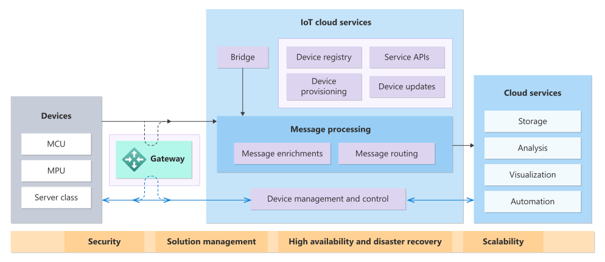

# SOLUCIONES EN LA NUBE: SOLUCIONES IOT

## ¿QUÉ ES UNA SOLUCIÓN IOT?
Una solución IoT combina hardware y software para intercambiar datos a través de redes, 
tanto alámbricas como inalámbricas. Su propósito puede ser automatizar procesos, recopilar información desde los puntos periféricos de la red, 
asegurar el correcto funcionamiento de los equipos o garantizar una conectividad eficiente entre personas y sistemas en el momento y lugar adecuados. 
Los proveedores de soluciones IoT pueden ofrecer servicios de software, dispositivos de conectividad, componentes integrados para el diseño inalámbrico o herramientas 
para la gestión remota de los sistemas.

## ¿QUÉ OPCIONES DE SOLUCONES IOT HAY EN CLOUD?

1. Amazon Web Services (AWS IoT Core): AWS IoT Core permite conectar dispositivos a la nube de forma segura y gestionar sus datos en tiempo real. Ofrece integración con otros servicios de AWS, como análisis, inteligencia artificial y aprendizaje automático, lo que facilita el desarrollo de soluciones IoT avanzadas. También permite la gestión de dispositivos, procesamiento de datos y análisis.

2. Google Cloud IoT: Google Cloud IoT es una solución completamente administrada que permite conectar y gestionar dispositivos en la nube. Ofrece servicios como Cloud IoT Core, que permite conectar y gestionar dispositivos, BigQuery para el análisis de grandes volúmenes de datos, y servicios de machine learning que ayudan a extraer información valiosa de los datos IoT.

3. IBM Watson IoT: IBM Watson IoT se especializa en la conexión de dispositivos y sensores, proporcionando herramientas avanzadas para análisis de datos, monitoreo en tiempo real y gestión de dispositivos. Ofrece capacidades de inteligencia artificial (IA) para ayudar a las empresas a tomar decisiones basadas en datos, detectar anomalías y automatizar procesos.

4. Oracle IoT Cloud: Oracle IoT Cloud ofrece una plataforma completa para conectar, analizar y gestionar dispositivos IoT. Sus soluciones están diseñadas para monitorear datos en tiempo real y realizar análisis avanzados para mejorar la eficiencia operativa y tomar decisiones más informadas. Está profundamente integrado con otras soluciones empresariales de Oracle.

5. Siemens MindSphere: MindSphere es la solución de IoT basada en la nube de Siemens, orientada a la industria. Está diseñada para conectar dispositivos y recopilar datos para optimizar el rendimiento y los procesos industriales. Incluye capacidades de análisis avanzado y es ideal para aplicaciones en fabricación, infraestructura y energía.

6. Bosch IoT Suite: La Bosch IoT Suite es una plataforma de IoT que proporciona servicios para la conectividad, el análisis y la gestión de dispositivos. Está dirigida principalmente a sectores industriales y automotrices, y permite a las empresas desarrollar, operar y mantener soluciones de IoT a gran escala.

7. PTC ThingWorx: ThingWorx es una plataforma integral para el desarrollo de aplicaciones IoT, que incluye conectividad de dispositivos, análisis de datos y herramientas de visualización. Es conocida por su facilidad de uso en la creación de aplicaciones IoT personalizadas y su enfoque en la industria manufacturera y de productos conectados.

## ¿QUÉ ES AZURE IOT?
Azure IoT es un conjunto de servicios y herramientas en la nube que ofrece Microsoft para conectar, monitorear y controlar dispositivos de Internet de las cosas 
a gran escala. En otras palabras, permite que los dispositivos de IoT (como sensores o máquinas) se comuniquen con los servicios en la nube. A continuación,
se muestra un diagrama de cómo funcionan las soluciones IoT.

En este diagrama, 
