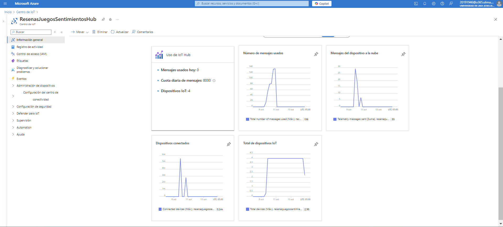

# SOLUCIONES EN LA NUBE: SOLUCIONES IOT

## ¿QUÉ ES UNA SOLUCIÓN IOT?
Una solución IoT combina hardware y software para intercambiar datos a través de redes, 
tanto alámbricas como inalámbricas. Su propósito puede ser automatizar procesos, recopilar información desde los puntos periféricos de la red, 
asegurar el correcto funcionamiento de los equipos o garantizar una conectividad eficiente entre personas y sistemas en el momento y lugar adecuados. 
Los proveedores de soluciones IoT pueden ofrecer servicios de software, dispositivos de conectividad, componentes integrados para el diseño inalámbrico o herramientas 
para la gestión remota de los sistemas.

## ¿QUÉ OPCIONES DE SOLUCIONES IOT HAY EN CLOUD?

1. Amazon Web Services (AWS IoT Core): AWS IoT Core permite conectar dispositivos a la nube de forma segura y gestionar sus datos en tiempo real. Ofrece integración con otros servicios de AWS, como análisis, inteligencia artificial y aprendizaje automático, lo que facilita el desarrollo de soluciones IoT avanzadas. También permite la gestión de dispositivos, procesamiento de datos y análisis.

2. Google Cloud IoT: Google Cloud IoT es una solución completamente administrada que permite conectar y gestionar dispositivos en la nube. Ofrece servicios como Cloud IoT Core, que permite conectar y gestionar dispositivos, BigQuery para el análisis de grandes volúmenes de datos, y servicios de machine learning que ayudan a extraer información valiosa de los datos IoT.

3. IBM Watson IoT: IBM Watson IoT se especializa en la conexión de dispositivos y sensores, proporcionando herramientas avanzadas para análisis de datos, monitoreo en tiempo real y gestión de dispositivos. Ofrece capacidades de inteligencia artificial (IA) para ayudar a las empresas a tomar decisiones basadas en datos, detectar anomalías y automatizar procesos.

4. Oracle IoT Cloud: Oracle IoT Cloud ofrece una plataforma completa para conectar, analizar y gestionar dispositivos IoT. Sus soluciones están diseñadas para monitorear datos en tiempo real y realizar análisis avanzados para mejorar la eficiencia operativa y tomar decisiones más informadas. Está profundamente integrado con otras soluciones empresariales de Oracle.

5. Siemens MindSphere: MindSphere es la solución de IoT basada en la nube de Siemens, orientada a la industria. Está diseñada para conectar dispositivos y recopilar datos para optimizar el rendimiento y los procesos industriales. Incluye capacidades de análisis avanzado y es ideal para aplicaciones en fabricación, infraestructura y energía.

6. Bosch IoT Suite: La Bosch IoT Suite es una plataforma de IoT que proporciona servicios para la conectividad, el análisis y la gestión de dispositivos. Está dirigida principalmente a sectores industriales y automotrices, y permite a las empresas desarrollar, operar y mantener soluciones de IoT a gran escala.

7. PTC ThingWorx: ThingWorx es una plataforma integral para el desarrollo de aplicaciones IoT, que incluye conectividad de dispositivos, análisis de datos y herramientas de visualización. Es conocida por su facilidad de uso en la creación de aplicaciones IoT personalizadas y su enfoque en la industria manufacturera y de productos conectados.

## ¿QUÉ ES AZURE IOT?
Azure IoT es un conjunto de servicios y herramientas en la nube que ofrece Microsoft para conectar, monitorear y controlar dispositivos de Internet de las cosas 
a gran escala. En otras palabras, permite que los dispositivos de IoT (como sensores o máquinas) se comuniquen con los servicios en la nube. A continuación,
se muestra un diagrama de cómo funcionan las soluciones IoT.

En este diagrama, se pueden apreciar las entradas, que serían los dispositivos IoT, algunos de los servicios cloud destinados a IoT que se ofrecen dentro de los que Azure IoT se destaca en el procesamiento de mensajes, que consta de el enrutamiento de mensajes y la telemetría, y en la administración y control de dispositivos, finalmente los datos extraídos se envían a los otros servicios cloud de uso más general destinados a almacenamiento, análisis, visualización y automatización. Todo esto se realiza, de modo que se cumpla con una mayor seguridad, poder gestionar la solución, tener alta disponibilidad y recuperación ante fallas y que sea escalable.

### FUNCIONES DE LOS SERVICIOS CLOUD EN IOT

En una solución de IoT, los servicios en la nube normalmente:
-	Recibe telemetría a escala desde los dispositivos y determina cómo procesar y almacenar esos datos.
-	Analizan los datos de telemetría para proporcionar información detallada, ya sea en tiempo real o después de que se produzcan los hechos.
-	Envía comandos desde la nube a un dispositivo específico.
-	Aprovisiona dispositivos y controla qué dispositivos pueden conectarse a la infraestructura.
-	Controlar el estado de los dispositivos y supervisar sus actividades.
-	Administran el firmware instalado en los dispositivos.

EJEMPLO:

Por ejemplo, en una solución de supervisión remota de una estación de bombeo de petróleo, los servicios en la nube usan los datos de telemetría de las bombas para identificar cualquier comportamiento anómalo. Cuando un servicio en la nube identifica una anomalía, puede enviar automáticamente un comando al dispositivo para tomar una acción correctiva. Este proceso implementa un ciclo de retroalimentación automatizado entre el dispositivo y la nube que aumenta considerablemente la eficiencia de la solución.

### PREOCUPACIONES GENERALES EN UNA SOLUCIÓN IOT

- Seguridad incluida la seguridad física, la autenticación, la autorización y el cifrado.
- Gestión de la solución, incluida la implementación y la supervisión.
- Alta disponibilidad y recuperación ante desastres para todos los componentes de la solución.
- Escalabilidad para todos los servicios de la solución.

## INTERCAMBIO DE DATOS EN AZURE IOT

Los dispositivos de Azure IoT usan los siguientes primitivos para intercambiar datos con servicios en la nube. Los dispositivos usan:
-	Mensajes del dispositivo a nube para enviar telemetría de series temporales a la nube. Por ejemplo, los datos de temperatura recopilados de un sensor conectado al dispositivo.
-	Dispositivos gemelos para compartir y sincronizar los datos de estado con la nube. Por ejemplo, un dispositivo puede usar el dispositivo gemelo para notificar el estado actual de una válvula que controla a la nube y recibir una temperatura de destino deseada de la nube.
-	Gemelos digitales para representar un dispositivo en el mundo digital. Por ejemplo, un gemelo digital puede representar la ubicación física de un dispositivo, sus funcionalidades y sus relaciones con otros dispositivos.
-	Cargas de archivos para archivos multimedia, como imágenes capturadas y vídeo. Los dispositivos conectados de forma intermitente pueden enviar lotes de telemetría. Los dispositivos pueden comprimir cargas para ahorrar ancho de banda.
-	Métodos directos para recibir comandos de la nube. Un método directo puede tener parámetros y devolver una respuesta. Por ejemplo, la nube puede llamar a un método directo para solicitar que el dispositivo se reinicie.
-	Mensajes de la nube al dispositivo para recibir notificaciones unidireccionales de la nube. Por ejemplo, una notificación de que una actualización está lista para descargarse.

### CONEXIONES DE DISPOSITIVOS PARA INTERCAMBIO DE DATOS

Un elemento esencial para la conexión de dispositivos a Azure IoT y permitir el intercambio de mensajes o datos es la cadena de conexión.

Una cadena de conexión de dispositivo proporciona a un dispositivo la información que necesita para conectarse de forma segura a un centro de IoT. La cadena de conexión incluye la siguiente información:
-	El nombre de host del centro de IoT.
-	Identificador de dispositivo registrado en IoT Hub.
-	La información de seguridad que el dispositivo necesita para establecer una conexión segura al centro de IoT.

Existen dos tipos de conexiones:

1. **Conexiones persistentes**: Las conexiones persistentes son necesarias cuando la solución necesita capacidades de comando y control. En escenarios de comando y control, la aplicación de IoT envía comandos a dispositivos para controlar su comportamiento casi en tiempo real. Las conexiones persistentes mantienen una conexión de red a la nube y se vuelven a conectar cada vez que hay una interrupción. Use el protocolo MQTT o AMQP para las conexiones de dispositivo persistentes a un centro de IoT. Los SDK de dispositivo IoT habilitan los protocolos MQTT y AMQP para crear conexiones persistentes a un centro de IoT.

2. **Conexiones efímeras**: Las conexiones efímeras son conexiones breves para que los dispositivos envíen telemetría al centro de IoT. Una vez que un dispositivo envía la telemetría, cierra la conexión. El dispositivo se vuelve a conectar cuando tiene más telemetría que enviar. Las conexiones efímeras no son adecuadas para escenarios de comando y control. Un cliente de dispositivo puede usar la API HTTP si lo único que necesita hacer es enviar telemetría.

## SERVICIOS DE AZURE IOT

### AZURE IOT HUB

El servicio **Azure IoT Hub** permite una comunicación bidireccional confiable y segura entre millones de dispositivos IoT y una solución basada en la nube.
IoT Hub es un componente básico que se puede usar para cumplir los desafíos de implementación de IoT, como:
•	La administración y la conectividad de los dispositivos de gran volumen.
•	La ingesta de telemetría de gran volumen.
•	El comando y el control de dispositivos.
•	El cumplimiento de la seguridad de los dispositivos.

### AZURE DIGITAL TWINS
Azure Digital Twins es un servicio de IoT que permite modelar un entorno físico. Usa un grafo de inteligencia espacial para modelar las relaciones entre personas, espacios y dispositivos. Al correlacionar los datos de los mundos digital y físico, se pueden crear soluciones dependientes del contexto.

### AZURE IOT CENTRAL
IoT Central usa gemelos digitales para sincronizar los dispositivos y datos del mundo real con los modelos digitales que permiten a los usuarios supervisar y administrar esos dispositivos conectados.

### AZURE IOT DEVICE PROVISIONING SERVICE
El mayor aporte de este servicio es la posibilidad de automatizar el registro de nuevos dispositivos dentro de tu centro de IoT (IoT Hub), puesto que tradicionalmente se deben de crear los dispositivos manualmente dentro del centro de IoT, con este servicio gracias a la cadena de conexión, el dispositivo al comunicarse con el centro, primero pasa por el device provisioning service, de modo que si es un dispositivo nuevo, automáticamente el device provisioning service crea un nuevo dispositivo en el centro de IoT. La cadena de conexión otorgada a los dispositivos es la del provisioning service.

**Un servicio de Azure que trabaja muy de la mano de Azure IOT es el Azure Stream Analytics.**

### AZURE STREAM ANALYTICS
Azure Stream Analytics es un motor de procesamiento de flujos totalmente administrado diseñado para analizar y procesar grandes volúmenes de datos de streaming con baja latencia. Se pueden identificar patrones y relaciones en los datos que se originan a partir de una variedad de orígenes de entrada, incluidas las aplicaciones, los dispositivos y los sensores. Es posible usar estos patrones para desencadenar acciones e iniciar flujos de trabajo, como la creación de alertas o la alimentación de información para una herramienta de informes. Stream Analytics también está disponible en el entorno de ejecución de Azure IoT Edge, lo que permite el procesamiento de datos directamente en el borde. Este sigue el esquema presentado en la imagen posterior, que explora entradas, procesamiento y salidas.

Un acción a realizar importante del Azure Stream Analytics es la creación de jobs de Azure Stream Analytics, los cuales se ejecutarán automáticamente cada cierto tiempo o por eventos, dependiendo de la configuración deseada, estos jobs tienen un elemento importante que es la ventana de tiempo o window, la cual pude ser de dos tipos: ventana fija (tumbling window) o ventana deslizante (sliding window)

1. Tumbling Window
- Definición: Una Tumbling Window (ventana fija) es un intervalo de tiempo que se "cierra" y no se superpone. Los datos se agrupan en bloques discretos, y cada bloque se procesa de forma independiente.
- Características:
  - No se superponen: Cada ventana es independiente, lo que significa que una vez que una ventana se cierra, no volverá a incluir más datos.
- Ejemplo: Si defines una ventana de 5 minutos, los datos del primer bloque se procesarán del minuto 0 al minuto 5, el segundo bloque del minuto 5 al minuto 10, y así sucesivamente.
-	Uso: Ideal para operaciones que requieren un análisis claro y definido de segmentos de tiempo, como conteos o sumas de datos.

2. Sliding Window
- Definición: Una Sliding Window (ventana deslizante) se mueve de manera continua y se superpone. Los datos se agrupan en intervalos que se solapan, permitiendo que las ventanas "deslicen" en el tiempo.
- Características:
  - Se superponen: Las ventanas se pueden solapar, lo que significa que una nueva ventana puede comenzar antes de que se cierre la anterior.
- Ejemplo: Si defines una ventana deslizante de 5 minutos que se desliza cada 1 minuto, cada nueva ventana abarcará los últimos 5 minutos a partir de cada minuto actual. Por ejemplo, en el minuto 1, abarcará del minuto 0 al minuto 5; en el minuto 2, del minuto 1 al minuto 6; y así sucesivamente.
-	Uso: Útil para análisis continuos y monitoreo en tiempo real, ya que permite observar cambios en los datos a lo largo del tiempo.

## VENTAJAS DE AZURE IOT
-	Entorno tipo Power Platform, No Code – Low Code (bajo código/ sin código)
-	Plantillas de dispositivo fáciles de utilizar
-	Capacidad para análisis y visualización de datos rápida y sencilla
-	Alto nivel de seguridad de autorización y autentificación
-	Soporte para diferentes tipos de mediciones de dispositivos

## DESVENTAJAS DE AZURE IOT
Realmente Azure IoT es una herramienta muy beneficiosa y amigable; sin embargo, al igual que todos los servicios de Azure, el problema de Azure IoT es el modelo de pricing, existen servicios como el Azure IoT Device Provisioning Service que no se encuentra en la capa gratuita de Azure, lo que implica incurrir en costos adicionales, del mismo modo el servicio de Azure IoT Hub está limitado en su capa gratuita, puesto que diariamente se limita al sistema a 8000 mensajes diarios, lo que está bien para un entorno de pruebas o un sistema pequeño que no apunta a escalar, pero si se desea que el sistema sea escalable, entonces hay un problema grande, pues la capa gratuita no será suficiente y se deben de considerar costos adicionales. Otro problema de Azure IoT es que existen servicios como Azure IoT Explorer que no se encuentran fácilmente en el entorno de Azure, sino que tienes que estar investigando y encontrando el repositorio en gitHub.

## CONSIDERACIONES TÉCNICAS

### Pasos Iniciales
Para poder utilizar Azure IoT primero se debe contar con una cuenta Microsoft. ya sea personal o institucional, puedes crearla entrando a este link: https://azure.microsoft.com/es-es/pricing/purchase-options/azure-account/
Allí se debe seleccionar si la cuenta será de prueba gratuita o pagada.

Una vez iniciada la cuenta Microsoft, en cualquiera de las opciones que elijas debes de registrar una tarjeta de crédito o débito, esto con el fin de cobrarte automáticamente cuando sobrepases la capacidad del plan gratuito.

Si cumples con los requisitos podrás acceder a azure en su capa gratuita, lo recomendable es que te registres como parte de una institución como la Universidad de Lima que cuenta con suscripción Azure for Students.

Una vez dentro de la plataforma de Azure, debes crear un grupo de recursos, aquí podrás almacenar todos los recursos Azure necesarios para ejecutar tu solución IoT, este grupo de recursos se configura fácilmente como se muestra en la imagen solo es poner un nombre al grupo y establecer una región.

Luego, hay que crear el Centro de IoT (IoT Hub) en el que vamos a poder administrar nuestros dispositivos y manejar la telemetría. Para ello, es necesario ya tener creado el grupo de recursos y seleccionarlo en el campo correspondiente, agregas un nombre al centro de IoT y luego seleccionas el nivel, entre estas opciones esta el nivel básico, estándar y gratis. Como se muestra en las imágenes depende del nivel y la cantidad de mensajes, el costo que se debe pagar. **Importante es mencionar que solo se puede crear una instancia de nivel gratuito, la que está limitada a 8000 mensajes diarios.**

Luego configuras la conectividad, es decir quién puede acceder, si se puede acceder al centro de manera pública o es privada y configurar la versión de TLS Mínima a utilizar, esto afecta a la seguridad de la capa de transporte.

Luego se configura cómo se administrará el centro de IoT, que puede ser RBAC (que es control de acceso basado en roles) o RBAC + Directiva de acceso compartido, puedes también asignarte en la creación el rol de colaborador de datos de IoT Hub, lo puedes hacer más adelante también.

Puedes agregar otros servicios, pero ten en cuenta que los otros servicios no siempre son compatibles con el nivel escogido de tu centro de IoT, y algunos no son gratuitos y se cobran a parte.

Dentro del centro de IoT es necesario revisar las estadísticas, porque ahí puedes visualizar los dispositivos que tienes, cuántos mensajes hay de dispositivo a la nube y cuántos mensajes diarios llevas, en caso desees llevar la cuenta para tus 8000 mensajes diarios de la capa gratuita. 

Luego dentro del centro IoT, puedes crear los dispositivos que necesites para tu solución, esto lo lograrás configurando un ID, configurando el tipo de autenticación o la clave que tendrá si la comunicación requerirá de algún certificado de autenticación y la habilitación o deshabilitación de la conexión del dispositivo al centro IoT.

Para visualizar de mejor manera tus dispositivos y los mensajes que envías desde tus dispositivos a la nube, puedes usar el Azure IoT Explorer, lastimosamente, esta herramienta la debes buscar en el github de Azure, pero aquí dejo el link: https://github.com/Azure/azure-iot-explorer/releases/tag/v0.15.8.

En el Azure IoT Explorer, solo debes ingresar la cadena de conexión principal de tu centro de IoT que la encuentras en la pestaña de Directivas de Acceso Compartido en tu centro IoT.

Para ver los mensajes entras a un dispositivo de tu centro de IoT e ingresas a la pestaña Telemetría

Finalmente, puedes agregar un job de Azure Stream Analytics con entradas en el centro de IoT y salidas en un Power BI, pero en líneas generales tendría la base de tu solución IoT. A continuación se presenta una demo para que se pueda visualizar de mejor manera cómo funciona en general Azurer IoT

## DEMO

Caso:
Tomando como contexto el sistema de recomendación de juegos planteado para el trabajo, en el que los clientes puedan calificar y reseñar los juegos que deseen, así como visualizar en dashboards las estadísticas de cada juego y las reseñas que los mismos tienen, con posibilidad de filtrar las reseñas por cada usuario o juego; para ello se establece una solución de IoT que permita que mediante diversos dispositivos conectados a un solo Hub se pueden recepcionar las reseñas y calificaciones que los usuarios envíen a través de los dispositivos, estos datos se procesarán y se mostrarán en un Power BI Desktop.

Para la demo, es necesario tener un centro IoT configurado y un job de Azure Stream Analytics, asimismo se incluyen códigos para poder ir enviando mensajes desde los dispositivos que simulan a los usuarios. Ejecute los códigos en Visual Studio Code o en algún IDE que soporte Python.

Link a Video con Demo:

Link a Power BI: https://app.powerbi.com/links/1AZxrEs6wC?ctid=e46d3862-8595-45d1-9b69-630798d8902d&pbi_source=linkShare

Link a Códigos en Visual Studio Code: [Ver Codigos](../trabajoIndividual/Codigos)

## FUENTES:
https://learn.microsoft.com/es-es/azure/iot/howto-use-iot-explorer
https://learn.microsoft.com/es-es/azure/iot/iot-overview-analyze-visualize
https://learn.microsoft.com/es-es/azure/iot/iot-overview-device-management
https://learn.microsoft.com/es-es/azure/iot/iot-overview-device-connectivity
https://learn.microsoft.com/es-es/azure/iot/iot-introduction
https://learn.microsoft.com/es-es/azure/stream-analytics/stream-analytics-get-started-with-azure-stream-analytics-to-process-data-from-iot-devices
https://learn.microsoft.com/es-es/azure/iot/iot-services-and-technologies
https://learn.microsoft.com/es-es/azure/architecture/example-scenario/iot/event-routing
https://www.cosmoconsult.com/pe/insights/blog/ventajas-de-azure-iot-central
https://es.digi.com/blog/post/iot-solutions#:~:text=Una%20soluci%C3%B3n%20IoT%20utiliza%20hardware,las%20personas%20y%20los%20sistemas
https://github.com/Azure/azure-iot-explorer/releases/tag/v0.15.8
