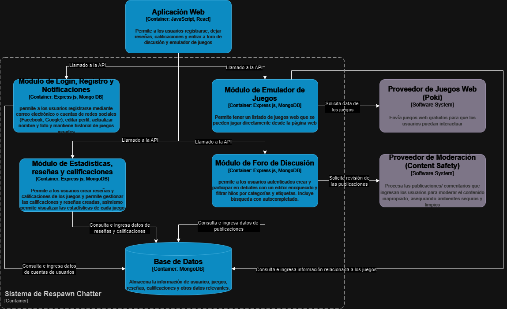

# 5.3. Componentes

**Descripción:** Plataforma web que conecta personas con intereses en videojuegos, permitiendo participar en discusiones, probar juegos web y compartir opiniones.

### Usuarios:

- **Usuarios**
  - **Interacción:** Los usuarios de Respawn Chatter pueden ver publicaciones, notificaciones, buscar discusiones en el foro y probar juegos web a través de la plataforma. También interactúan con el contenido generado por otros usuarios y pueden participar en discusiones activas sobre diversos temas de videojuegos.

### Sistemas Externos:

- **Proveedor de Moderación (Azure AI content safety)**
  - **Interacción:** El sistema de Respawn Chatter envía publicaciones y comentarios a este proveedor para que los revise y filtre el contenido inapropiado. Asegura que el foro mantenga un ambiente seguro y limpio al moderar el contenido basado en texto.

- **Proveedor de Juegos Web (Poki)**
  - **Interacción:** El sistema de Respawn Chatter se conecta con Poki para acceder a una serie de juegos web gratuitos, permitiendo que los usuarios puedan interactuar y jugar directamente en la plataforma.

### Sistemas Internos:

- **Aplicación Web**
  - **Interacción:** Desarrollada con **JavaScipt**, permite a los usuarios poder acceder a la página web desde un navegador web.

- **Página Web**
  - **Interacción:** Desarrollada con **JavaScript y React**, permite a los usuarios acceder a la interfaz gráfica que permitirá dejar reseñas, gestionar las reseñas que se hayan creado, dejar una calificación y juegar algunos juegos vía emulador.

- **API**
  - **Interacción:** Actúa como puente entre la aplicación web / página web y los componentes como la base de datos y el proveedor de moderación, esto lo realiza mediante funciones GET, POST, PUT, PATCH, DELETE.

- **Base de Datos**
  - **Interacción:** Se utiliza **MongoDB** y almacena la información de reseñas, calificaciones, usuarios, juegos y otros datos importantes.

### Sistema de Respawn Chatter

- **Sistema de Respawn Chatter**
  - **Interacción:** Es la plataforma central que conecta a los usuarios para discutir temas relacionados con videojuegos, probar juegos web y compartir opiniones. Se comunica con otros sistemas para proveer moderación de contenido inapropiado y traer juegos web a la plataforma para que los usuarios puedan interactuar con ellos. Alberga múltiples módulos
  - Módulo de Login, registro y notificaciones
  - Módulo de Foro de discusión
  - Módulo de Emulador de Juegos
  - Módulo de Estadística, reseñas y calificaciones

### Imagen: 

