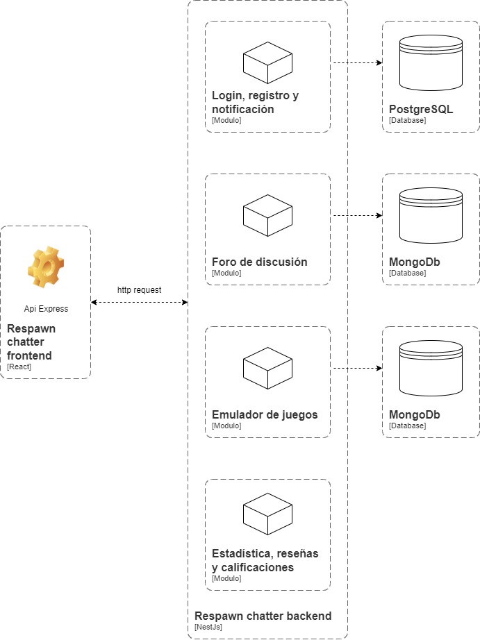

# 9.3. Iteración 2: Identificar estructuras para soportar la funcionalidad primaria

### Paso 1: Revisar Entradas

| **Propósito de Diseño**                              | **Funcionalidad Primaria**                    | **Escenarios de Calidad**                        | **Restricciones y Preocupaciones de Arquitectura**               |
|------------------------------------------------------|-----------------------------------------------|-------------------------------------------------|-------------------------------------------------------------------|
| Identificar estructuras para soportar la funcionalidad primaria. | UC-01, UC-02, UC-08, UC-10, UC-11, UC-17, UC-18, UC-19, UC-22, UC-30, UC-31 | QA-02, QA-04, QA-06, QA-07                      | CON-01, CON-03, CON-05                                          |

### Paso 2: Establecer objetivo de la iteración

El objetivo de esta iteración es diseñar e implementar la estructura inicial para los módulos críticos del sistema: login, foro de discusión, estadísticas y notificaciones. Esto incluye bases de datos, comunicación entre microservicios, y la validación de atributos de calidad como escalabilidad, seguridad y disponibilidad.

### Paso 3: Elegir uno o más elementos del sistema a refinar

En esta iteración, se refinarán los módulos de login, foro de discusión, estadísticas y notificaciones, asegurando que se alineen con los casos de uso y los atributos de calidad establecidos.

### Paso 4: Elegir uno o más conceptos de diseño que satisfacen el driver seleccionado

| **Código** | **Decisión de Diseño**                                                        | **Fundamentación**                                                                                                                                                                                     |
|------------|--------------------------------------------------------------------------------|--------------------------------------------------------------------------------------------------------------------------------------------------------------------------------------------------------|
| **DEC-08** | Modularización interna en la arquitectura monolítica                          | La arquitectura monolítica se organiza de manera modular para separar las responsabilidades entre los módulos principales: login, foro, estadísticas y notificaciones, asegurando mantenibilidad y escalabilidad (UC-01, UC-02, UC-08, UC-10). |
| **DEC-09** | Uso de JWT para autenticación y autorización segura                           | JWT proporciona una solución eficiente y escalable para la autenticación y autorización dentro de una arquitectura monolítica, cumpliendo los requisitos de seguridad (QA-02, QA-06).                                                      |
| **DEC-10** | Moderación de contenido en el foro mediante Azure Content Safety              | Permite la validación automática de contenido en publicaciones y comentarios, asegurando un entorno seguro y alineado con los estándares de calidad establecidos (UC-11, QA-06).                                                           |
| **DEC-11** | Sistema de notificaciones con Firebase Cloud Messaging                        | Asegura la entrega en tiempo real de notificaciones relevantes, optimizando la experiencia del usuario y cumpliendo con los requisitos de disponibilidad (UC-18, UC-19, QA-07).                                                             |
| **DEC-12** | Uso de PostgreSQL para la persistencia de datos estructurados                | PostgreSQL gestiona datos sensibles y transaccionales, como credenciales y estadísticas, asegurando consistencia y escalabilidad (UC-22, QA-04).                                                                                          |
| **DEC-13** | Uso de MongoDB para manejar datos no estructurados del foro y notificaciones  | MongoDB es ideal para gestionar datos dinámicos como publicaciones, comentarios y logs de notificaciones, mejorando el rendimiento y la flexibilidad en consultas frecuentes (UC-10, UC-30, UC-31).                                      |

### Paso 5: Instanciar elementos de arquitectura, asignar responsabilidades y definir interfaces

| **Código** | **Decisión de Diseño**                                                            | **Fundamentación**                                                                                                                                                                        |
|------------|------------------------------------------------------------------------------------|------------------------------------------------------------------------------------------------------------------------------------------------------------------------------------------|
| **DEC-14** | División modular en la arquitectura monolítica                                    | Cada módulo (login, foro, estadísticas, notificaciones) tendrá su propia capa lógica dentro del monolito, separando responsabilidades y facilitando la implementación de pruebas unitarias (UC-10, UC-11, QA-07).                |
| **DEC-15** | Gestión centralizada de datos mediante PostgreSQL y MongoDB                       | Los datos estructurados se gestionarán con PostgreSQL y los no estructurados con MongoDB, asegurando rendimiento óptimo y compatibilidad con los requisitos funcionales (UC-22, UC-31, QA-04).                                     |
| **DEC-16** | Implementación de APIs internas entre módulos para facilitar la integración       | Las interfaces internas permitirán una comunicación eficiente entre los módulos dentro del monolito, mejorando la escalabilidad y manteniendo la cohesión (CON-01, CON-03, QA-07).                                             |
| **DEC-17** | Integración de Firebase para el manejo de notificaciones                          | El servicio de notificaciones utilizará Firebase para enviar alertas en tiempo real, cumpliendo con los atributos de calidad de disponibilidad y escalabilidad (UC-19, UC-30, QA-07).                                            |

### Paso 6: Bosquejar vistas y registrar decisiones de diseño

### Paso 7: Revisión de objetivos

| **No abordado** | **Parcialmente abordado** | **Completamente abordado** | **Decisión de diseño** |
|-----------------|---------------------------|----------------------------|------------------------|
|                 |                           | UC-01                      | DEC-08, DEC-09         |
| UC-02           |                           |                            | DEC-08, DEC-09         |
|                 |                           | UC-08                      | DEC-08                 |
|                 | UC-10                     |                            | DEC-08, DEC-13, DEC-14 |
|                 |                           | UC-11                      | DEC-10, DEC-14         |
|                 |                           | UC-17                      | DEC-11, DEC-17         |
|                 |                           | UC-18                      | DEC-11, DEC-17         |
|                 | UC-19                     |                            | DEC-11, DEC-17         |
|                 | UC-22                     |                            | DEC-12, DEC-15         |
|                 |                           | UC-30                      | DEC-13, DEC-17         |
|                 |                           | UC-31                      | DEC-13, DEC-15         |
|                 |                           | QA-02                      | DEC-09                 |
|                 |                           | QA-04                      | DEC-12, DEC-15         |
|                 |                           | QA-06                      | DEC-10                 |
|                 |                           | QA-07                      | DEC-08, DEC-11, DEC-16 |
|                 |                           | CON-01                     | DEC-16                 |
|                 |                           | CON-03                     | DEC-16                 |
|                 |                           | CON-05                     | DEC-08                 |
